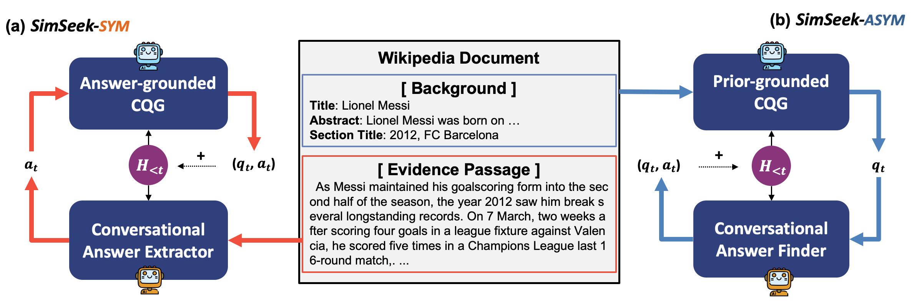

# SIMSEEK

Official implementation of "[Generating Information-Seeking Conversations from Unlabeled Documents](https://arxiv.org/abs/2205.12609)". <br>

> **[Gangwoo Kim<sup>1*</sup>](https://scholar.google.com/citations?user=TmWGEFgAAAAJ&hl=en)**, **[Sungdong Kim<sup>2,3*</sup>](https://scholar.google.com/citations?user=xKrSnDoAAAAJ&hl=en)**, [Kang Min Yoo<sup>2,4</sup>](https://scholar.google.com/citations?user=BqaWtH8AAAAJ&hl=en), [Jaewoo Kang<sup>1+</sup>](https://scholar.google.co.kr/citations?user=RaBZafQAAAAJ&hl=en)<br>
> Korea University<sup>1</sup>, NAVER AI LAB<sup>2</sup>, KAIST AI<sup>3</sup>, NAVER Clova<sup>4</sup> <br>
> *: equal contribution, +: corresponding author <br>
> In EMNLP 2022.

<p align="center">
    
</p>

> **Abstract** In this paper, we introduce a novel framework, SIMSEEK, (Simulating information-Seeking conversation from unlabeled documents), and compare its two variants. In our baseline SIMSEEK-SYM, a questioner generates follow-up questions upon the predetermined answer by an answerer. On the contrary, SIMSEEK-ASYM first generates the question and then finds its corresponding answer under the conversational context. Our experiments show that they can synthesize effective training resources for CQA and conversational search tasks. As a result, conversations from SIMSEEK-ASYM not only make more improvements in our experiments but also are favorably reviewed in a human evaluation. We finally release a large-scale resource of synthetic conversations, WIKI-SIMSEEK, containing 2 million CQA pairs built upon Wikipedia documents. With the dataset, our CQA model achieves state-of-the-art performance on a recent CQA benchmark, QuAC.

# Environments

```
torch==1.9.0
transformers==4.12.1
nltk==3.5
parlai==1.3.0
```

Run `pip3 install -r requirements.txt` to setup the environments.


## Get dataset & checkpoints

We split the original training set of [QuAC](https://quac.ai/) into the seen and unseen set.
We also provide the crawled documents along with the generated conversations.
You can download our datasets and checkpoints from [google drive](https://drive.google.com/drive/folders/1Y9oovlBGSMiknUEpvoKFapnrRVAAiCTU?usp=sharing)

# Training modules of SIMSEEK
You can train each module of SIMSEEK by yourself. For doing so, please set the environment variables first. 
## Set environment variables

```
export DATA_PATH= # path of dirctory containing QuAC dataset.
export OUTPUT_PATH= # output path to save model ckpt and corresponding outputs.
```
For all modules, it trains models on `train.json` file and evaluate them on `dev.json` in the `$DATA_PATH` directory, in default.
The resulting checkpoint or prediction files are saved in the `$OUTPUT_PATH` directory.

## 1. SIMSEEK-SYM
### 1) Training CAE

```
$ python3 train_cae.py \
    --data_path $DATA_PATH \
    --output_path $OUTPUT_PATH \
    --train_batch_size 8 \
    --eval_batch_size 16 \
    --num_train_epochs 3 \
    --learning_rate 3e-5 \
    --use_previous_qa
```
The script fine-tunes the conversational answer extractor (CAE) modules on the training set. It only supports `bert-base-uncased` backbone. Note that `--use_previous_qa` indicates whether the module will consider the conversation history or not.

### 2) Training Answer-grounded CQG

```
$ python3 train_cqg.py \
    --data_path $DATA_PATH \
    --output_path $OUTPUT_PATH \
    --task answer_cqg \
    --train_batch_size 16 \
    --eval_batch_size 32 \
    --num_train_epochs 10 \
    --learning_rate 3e-5 \
    --max_passage_length 384 \
    --fewshot_t5
```
The script fine-tunes the answer-grounded CQG module and provides its prediction/evaluation results on the development set. Note that we use `--fewshot_t5` technique of [the previous study](https://arxiv.org/abs/2109.01951), leading to the performance gain.

### 3) Training Round-trip Filterer

Please see [Training CQA Models](#training-and-evaluating-cqa-models)

## 2. SIMSEEK-ASYM


### 1) Training Prior-grounded CQG

```
$ python3 train_cqg.py \
    --data_path $DATA_PATH \
    --output_path $OUTPUT_PATH \
    --task prior_cqg \
    --train_batch_size 16 \
    --eval_batch_size 32 \
    --num_train_epochs 10 \
    --learning_rate 3e-5 \
    --max_passage_length 384 \
    --fewshot_t5
```
The script fine-tunes the prior-grounded CQG module and provides its prediction/evaluation results on the development set.
Note that we use `--fewshot_t5` technique of [the previous study](https://arxiv.org/abs/2109.01951), leading to the performance gain.

### 2) Training CAF

Please see [Training CQA Models](#training-and-evaluating-cqa-models)

# Training and Evaluating CQA Models
We fully release the scripts that can train and evaluate various CQA backbones (i.e., BERT, RoBERTa, Longformer). They are based on [transformers](https://github.com/huggingface/transformers) library by huggingface and we expand it onto the challenging CQA benchmark, QuAC. First, set the environment variables as belows.

## Set environment variables

```
export DATA_PATH=   # path of dirctory containing QuAC dataset.
export OUTPUT_PATH= # output path to save model ckpt and corresponding outputs.
export MODEL_TYPE=  # 'bert', 'roberta', 'longformer'
export MODEL_NAME=  # 'roberta-base', 'roberta-large', 'allenai/longformer-large-4096'
```

## BERT / RoBERTa
```
$ python3 run_cqa.py \
    --data_path $DATA_PATH \
    --output_dir $OUTPUT_PATH \
    --model_type $MODEL_TYPE \ 
    --model_name_or_path $MODEL_NAME \
    --do_train \
    --do_eval \
    --do_not_validate \
    --num_train_epochs $EPOCH \
    --learning_rate $LR \
    --weight_decay $DECAY \
    --max_answer_length 64
```
BERT and RoBERTa models can be trained and evaluated by this script. Note that we allow them to provide the longer answers by using `--max_answer_length`.
## Longformer
```
$ python3 run_cqa.py \
    --data_path $DATA_PATH \
    --output_dir $OUTPUT_PATH \
    --model_type $MODEL_TYPE \ 
    --model_name_or_path $MODEL_NAME \
    --do_train \
    --do_eval \
    --do_not_validate \
    --num_train_epochs $EPOCH \
    --learning_rate $LR \
    --weight_decay $DECAY \
    --concat_titles \
    --max_query_length 768 \
    --max_seq_length 2048 \
    --min_remain_query 3 \
    --max_history 12
```
[Longformer](https://arxiv.org/abs/2004.05150) has a better capacity for the maximum input sequences, allowing it to consider longer conversation history. We empirically found that it performs best in the above setup. Note that previous conversations are concatenated with the current question and they cannot exceed `--max_query_length`. 

## Using Multiple GPUs

```
export N_GPU= # the number of GPU 

python3 ddp_launcher.py $ARGS
```

We highly recommend to use multiple GPUs to train the large size of CQA backbones (especially `Longformer-large`) with DDP. 
The script enables to run both backbones with the same arguments as `$ARGS`.

## Hyperparameters & Results

### Results on QuAC (seen + unseen)
```
RoBERTa-base
export LR=3e-5 DECAY=0 EPOCH=2
{'F1': 67.44965651616177}

RoBERTa-large
export LR=1.5e-5 DECAY=0 EPOCH=2
{'F1': 70.25182128338598}

Longformer-large
export LR=1.5e-5 DECAY=0 EPOCH=2
{'F1': 73.81525234062102}
```
You might obtain better results when training CQA models on whole QuAC training set becuase of the difference in the experimental setup.
# Synthetic CQA Generation
You can generate synthetic conversations from Wikipedia documents using SIMSEEK. After training its components on your own or downloading our checkpoints [here](#get-checkpoints), set their locations as follows.
## Set environment variables

```
export DATA_PATH=      # documents without conversations (QuAC format)
export OUTPUT_PATH=    # output path to save model ckpt and corresponding outputs.
export CQG_MODEL_PATH= # path of directory containing the CQG (answer/prior-grounded) model
export MAX_TURN=       # if it reaches the maximum turn, conversations are terminated

## SYM
export CAE_MODEL_PATH= # path of directory containing the CAE model 

## ASYM
export CQA_MODEL_TYPE= # the type backbone CQA model 'bert', 'roberta', 'longformer'
export CQA_MODEL_PATH= # path of directory containing the CQA model 
```
All scripts below takes `train.json` of QuAC format as input and generate synthetic conversations upon them. The resulting files are saved to `$OUTPUT_PATH`. 
## 1. SIMSEEK-SYM
```
python3 gen_cqa_sym.py \
    --data_dir $DATA_PATH \
    --output_dir $OUTPUT_PATH \
    --cae_model_name_or_path $CAE_MODEL_PATH \
    --cqg_model_name_or_path $CQG_MODEL_PATH \
    --max_turn $MAX_TURN
```
You can download our trained modules from `<Google Drive>/models` and set their locations as `$CAE_MODEL_PATH` or `$CQG_MODEL_PATH`. The framework will terminate conversations if they reach the maximum turn `$MAX_TURN`.

## 2. SIMSEEK-ASYM
```
python3 gen_cqa_asym.py \
    --data_dir $DATA_PATH \
    --output_dir $OUTPUT_PATH \
    --cqa_model_type $CQA_MODEL_TYPE \
    --cqa_model_name_or_path $CQA_MODEL_PATH \
    --cqg_model_name_or_path $CQG_MODEL_PATH \
    --max_turn $MAX_TURN \
    --qg_num_return_seq $NUM_QUESTION
```
Note that prior-CQG generates multiple questions of `$NUM_QUESTIONS` and randomly sample final one. We also observe that hyperparameters for generation models, such as `--temperature` or `--beam_size` improve or degrade the CQG performances.

# Convesational Search
For implementing dense retrievers for the conversational search, please refer to our another [repository](https://github.com/naver-ai/cs-shortcut)

## Huggingface Model

## Citation
```bibtex
@inproceedings{kim2022generating,
  title={Generating Information-Seeking Conversations from Unlabeled Documents},
  author={Kim, Gangwoo and Kim, Sungdong and Yoo, Kang Min and Kang, Jaewoo},
  booktitle={EMNLP},
  year={2022}
}
```

## License

Licensed under [CC BY-NC 4.0](LICENSE)

```
SimSeek
Copyright 2022-present NAVER Corp.
CC BY-NC-4.0 (https://creativecommons.org/licenses/by-nc/4.0/)
```
